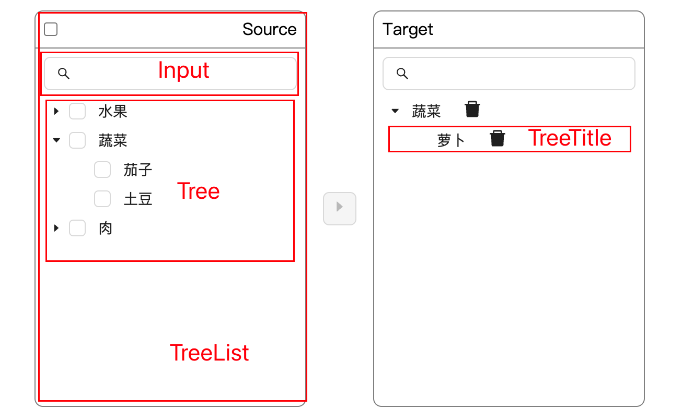

## 支持功能

- [x] 数据穿梭
  - [x] 左树单独一项 => 右树 (涉及到数据合并)
  - [x] 左树父级下所有子项 => 右树
  - [x] 右树单独一项删除
  - [x] 右树删除父级下所有子项
  - [x] 右树支持全部删除
- [x] 左树支持全选
  - [x] 仅在单层数据结构场景下支持全选 多层级数据结果下涉及到按需加载 无法支持全选
- [ ] 最多支持选择 200 项
  - [ ] 左树已选择项+右树项 总数超过 200 时禁用穿梭 button
- [x] 按需加载
  - [x] 多层级数据结构场景下 在 check 父级或者展开父级时会去请求父级下的所有子项数据
  - [x] 如果以及加载过子项 不需要重复加载
- [ ] 右树项支持重命名
  - [ ] 重命名后的样式
  - [ ] 重命名后的项 在删除回左树时要做清除重命名后的名称处理
- [ ] 重名校验 报错样式
- [ ] 搜索
  - [ ] 左树搜索 发起请求
  - [ ] 右树搜索 本地搜索 不需要发起请求

## 组件实现
### DOM 结构

基于两个 Tree 组件实现左右树逻辑，由于需要支持重命名和删除操作，需要手动渲染 titleRender，封装了 TreeTitle 组件来定制化处理，整体结构为 TreeList(左树) + 穿梭 Button + TreeList(右树)


### 数据节点类型

```ts
interface DataProps {
  // 数据的唯一标识
  key: string;
  // 数据库或者表的名称
  title: string;
  // 当前数据节点类型
  type: 'table' | 'database';
  // 子节点 只有表有children
  children?: DataProps[];
  // 重命名之前的名称
  oldTitle?: string;
  // 是否为叶子节点
  isLeaf?: boolean;
  // 是否已加载
  isLoad?: boolean;
  // 重名校验 是否不唯一
  isNotUnique?: boolean;
}
```
